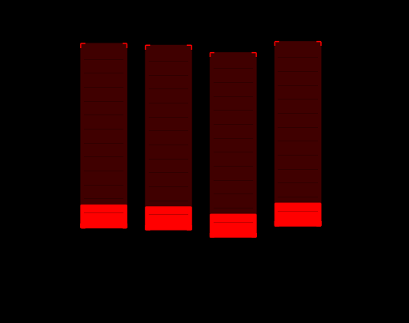
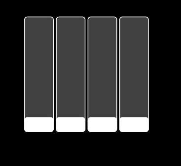
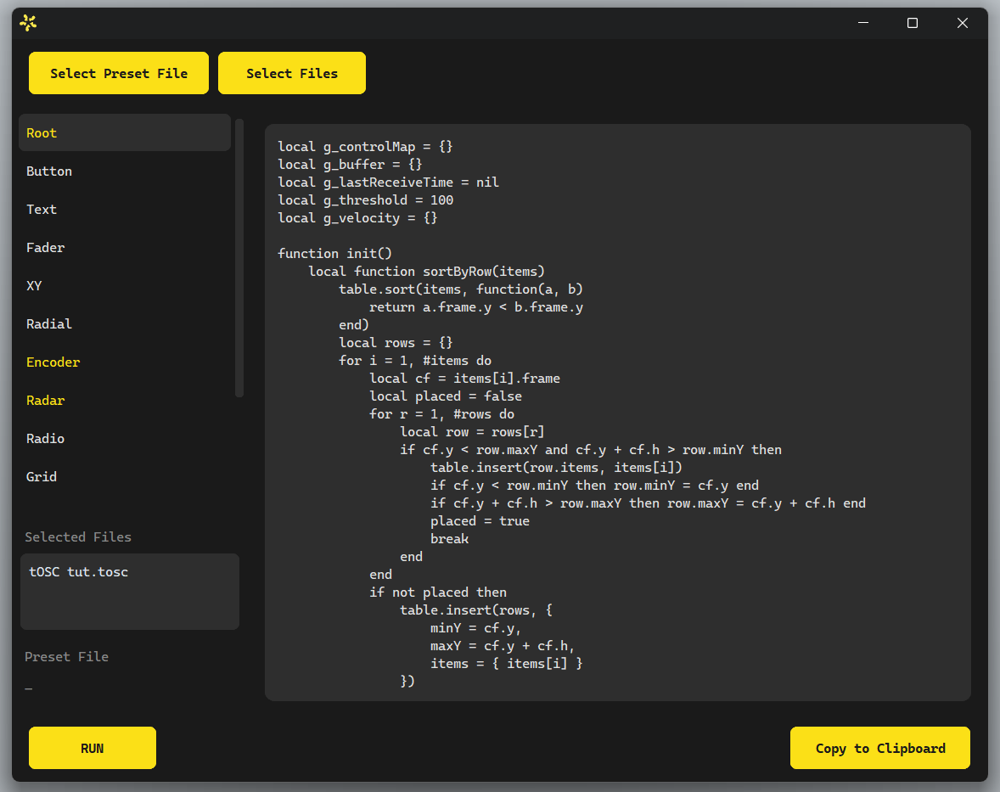
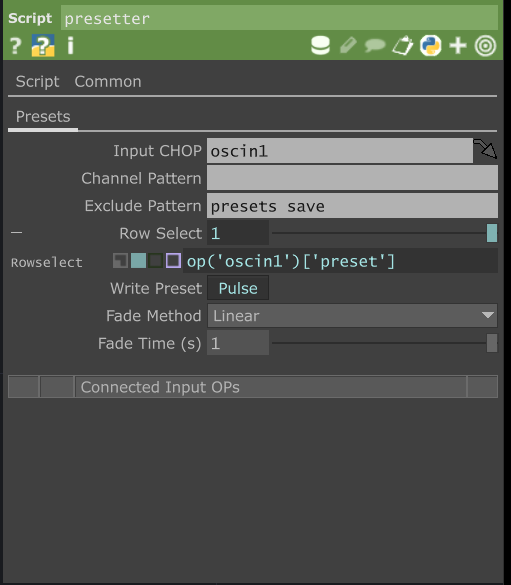
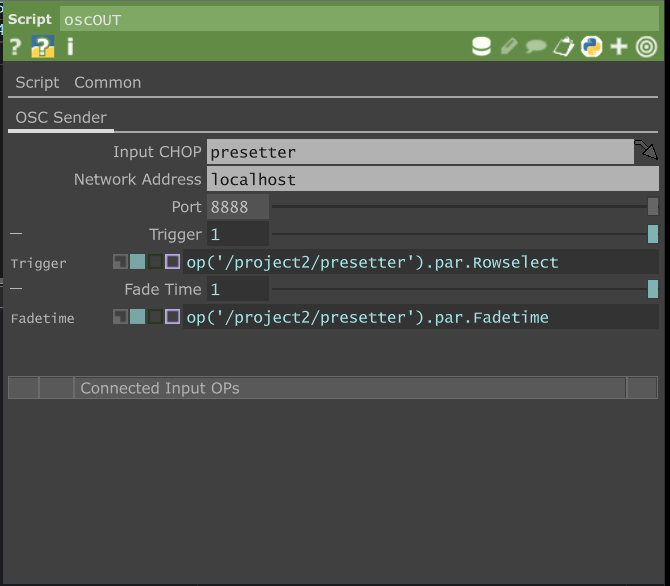
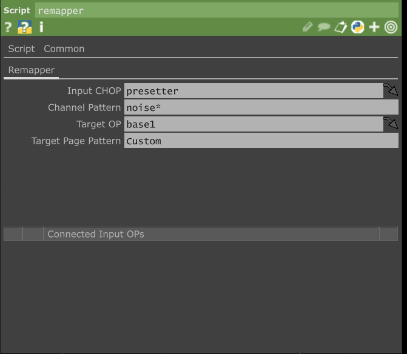
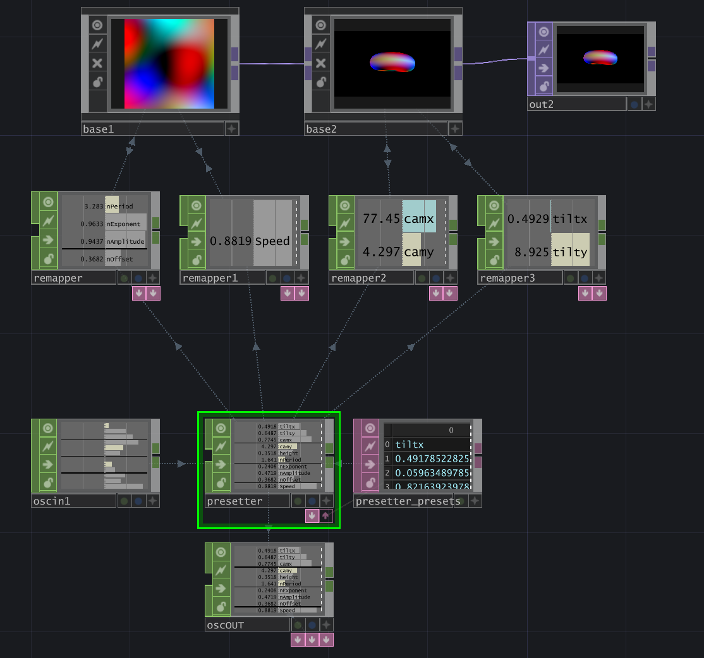

# tOSC Toolbox

A set of scripts and tools that streamline building TouchOSC interfaces for TouchDesigner. Handles layout, styling, address fixes, runtime behavior, preset systems, and parameter mapping.

The toolbox has three parts:

1. A **setup script** for tOSC — layout, naming, labels, style.
2. A **tOSC editor** — injects runtime scripts and rewrites problematic addresses.
3. A set of **TouchDesigner tools** — Presetter, OSCout, Remapper.

---

## 1. tOSC Setup Script

A Lua script pasted into the script field at the document root, then run with the play button below the script field. Handles everything tedious in the tOSC editor.

### What it does

- **Layout** — sorts grouped controls left-to-right, applies consistent gap and padding, resizes the group to fit its children.
- **Naming** — renames controls inside groups using `groupName + typeAbbreviation + index` (e.g. `camFdr1`, `camFdr2`, `camMom1`). Controls left at root keep their original names.
- **Labels** — Labels must be **pre-placed** at root (a "label pool") — the script moves and styles them, it does not create them. Add more labels than you think you'll need; leftovers can be deleted after running.
- **Master style** — copies style parameters (color, background, outline, corner radius, grid color) from a single tagged control to every other control. Place one control at root, set its tag to `master`, and style it however you want — that style propagates on the next run.

 

### Settings

Edit these at the top of the script:

```lua
-- ── LAYOUT CONFIG ────────────────────────────────────────────
local gap               = 5     -- spacing between controls inside a group
local groupPad          = 4     -- padding of group borders around controls

-- ── LABEL CONFIG ────────────────────────────────────────────
local createLabels      = true  -- false to turn off
local createGroupLabels = true  -- false to turn off group labels only

local labelPad          = 5     -- gap above controls
local textSize          = 10
local textColor         = Color(1, 1, 1, 1)
local cellLabelColor    = Color(0, 0, 0, 1)
```

### Notes

- Re-init the UI once after running for control names to update.
- Grid label placement only works for square grids (1:1 ratio).
- A control tagged `none` is skipped entirely (not renamed, styled, or labeled).

---

## 2. tOSC editor

A standalone program that prepares your `.tosc` file for runtime. Required because parts of this work exceed the tOSC Lua API.



### Injects runtime scripts

The program pastes scripts into the file and finds the controls that need per-control scripts automatically. Existing scripts are cleaned up first, so you don't need to manually delete the setup script.

- **Ping script** — pings every control once on interface start, so all controls register in TouchDesigner without manual touching.
- **Encoder script** — makes encoders behave as continuous rotation instead of jumping between 1 and 0. Necessary for camera control, unbounded rotations, and preset systems that update the UI on recall.
- **Radar script** — same continuous-value fix, applied to radar controls.

### Rewrites problematic default addresses

tOSC's defaults don't always play well with TouchDesigner. The program rewrites:

- **XY** — default sends both axes in a single combined message. We split it into two separate addresses so each axis has its own channel in TD.
- **Radar** — same split as XY.
- **Grid** — default sends an individual address per cell. We rewrite to one shared address for the whole grid plus a value identifying which cell was triggered. Important for using grids as preset selectors or step sequencers.

### Custom address + script presets

You can override the defaults by loading a **preset file**. Edit a control's address (and script, if needed) the way you want it in a tOSC template, save it, and load it as a preset in the program. The program reads both the address **and** the attached scripts from the preset and applies them to all matching control types in your target file.

This is the main extensibility hook — you can build your own conventions for how grids, encoders, radars, etc. behave and reuse them across projects.


### Other features

- Highlights all control types that will be edited.
- Shows the current address setting for each.
- Lets you edit scripts directly in the program before applying.
- Can run on multiple `.tosc` files at once.

---

## 3. TouchDesigner Tools

Three Script CHOPs that handle the TD-side problems: presets, syncing the UI back to preset state, and remapping normalized values onto custom parameter ranges.

> tOSC controls always send values in the **0–1 range**. Custom parameters in TouchDesigner have their own arbitrary ranges (e.g. `0–360` for rotation, `-1 to 1` for offsets). The Presetter and OSCout work in the normalized 0–1 space so the UI stays in sync. The Remapper bridges that normalized space to your actual parameter ranges.

### Presetter

Stores and recalls states of incoming OSC messages.



**Parameters**

- **Input CHOP** — connect via wire or this parameter. Receives OSC channels.
- **Channel Pattern** — channels to include in presets. Custom pattern matcher: space-separated patterns, `*` wildcard, `[1-3]` ranges, combinations like `pattern*[1-3]`.
- **Exclude Pattern** — channels to exclude. At minimum, exclude the control that triggers preset recall.
- **Row Select** — selects a row in the preset table. Changing this **recalls** the preset stored in that row (with the configured fade).
- **Write Preset** — writes the current state into the selected row. Same control is used to overwrite: select an existing row, adjust values, hit write.
- **Fade Method** — interpolation type between presets.
- **Fade Time** — fade duration in seconds.

### OSCout

Sends preset changes back to tOSC so the interface stays in sync after a recall. Without this, controls jump the next time you touch them.



**Parameters**

- **Input CHOP** — connect a Presetter.
- **Network Address** — your control device's IP. Find it in tOSC under _OSC connections settings_, via the info button next to the receive port.
- **Port** — match tOSC's receive port (default `8888`).
- **Trigger** — defaults to the connected Presetter's Row Select, so OSCout fires on preset change. Overridable.
- **Fade Time** — defaults to the connected Presetter's Fade Time. Overridable.

OSCout only sends when the Trigger value changes, and only for the duration of Fade Time. Each Presetter needs its own OSCout.

### Remapper

Connects to a Base and remaps normalized 0–1 OSC values onto the actual ranges of your custom parameters. Also handles parameter mapping automatically — no manual wiring.



**How mapping works**

The Remapper exports its incoming channels chronologically into the parameters of the target Base. Combined with the ping script (which reads tOSC controls left-to-right, top-to-bottom, with groups sub-iterated in the same order), this means **the order your controls appear in the UI = the order they map to parameters on the Base**.

**Parameters**

- **Input CHOP** — connect via wire or this parameter. Usually a Presetter.
- **Channel Pattern** — channels to map. Same pattern matcher as Presetter. Typically the group prefix from tOSC followed by `*` (e.g. `cam*`) to grab all controls in that group.
- **Target OP** — the Base whose custom parameters you want to drive.
- **Target Page Pattern** — which parameter page on the Base to map to.

**Notes**

- The export flag lives on the table DAT that unfolds via the second arrow on the CHOP.
- When duplicating a Remapper, change the Target OP or Target Page **before** turning the export flag on. Otherwise the previous Remapper's export flag deactivates silently (no crash).

---

## Usage

### Conception

1. Clean up your network and create Bases with custom parameters.
2. **Order matters.** Lay out controls in the same order as the parameters they'll drive — the Remapper exports chronologically and the ping script reads the UI left-to-right, top-to-bottom (groups sub-iterate in the same order).
3. To spatially separate controls for one Base across the UI, split them across parameter pages on the Base.

### Interface Setup

1. Create your controls in tOSC.
2. Group them. Name groups after your Bases / pages.
3. Add a label pool at root — drop in more LABEL controls than you think you'll need.
4. Add a `master`-tagged control at root, style it how you want.
5. Paste and run the **setup script** at root level.
    - Re-init the UI once for control names to update.
6. Delete leftover (unused) labels.
7. Open the **tOSC editor**, import your `.tosc`, and run it.

> 📷 _GIF: the full interface-setup flow — drop controls, group, paste script, run, add master, re-run._

### Connection

1. Add an OSC In CHOP in TouchDesigner.
2. Pick the right network IP, set network port to `7777`.
3. In tOSC: same IP as host and `7777` for **send**, `8888` for **receive**.
4. Launch the UI and confirm all controls show up in TD.

### Presetter Setup

1. Connect OSC In via wire or Input CHOP parameter.
2. Set the Channel Pattern (channels to include).
3. Set the Exclude Pattern. At minimum, exclude the control that triggers preset recall.
4. Write presets: select a row with Row Select, hit Write Preset. To overwrite, select an existing row, adjust values, write again.
5. Pick Fade Method and Fade Time.

### OSCout Setup

1. Connect the Presetter via wire or Input CHOP parameter.
2. Set Network Address to your control device's IP (in tOSC: _OSC connections settings_ → info button next to the receive port).
3. Port: same as tOSC's receive port (`8888`).
4. Trigger and Fade Time pull from the Presetter by default; override if needed.

### Remapper Setup

1. Connect the Presetter via wire or Input CHOP parameter.
2. Set the Channel Pattern — usually the group prefix from tOSC followed by `*` (e.g. `cam*`).
3. Set the Target OP (the Base).
4. If the Base has multiple parameter pages, set the Target Page Pattern.
5. When duplicating: the export flag is off by default. Change Target OP or Target Page **first**, then turn on the export flag.

### Combining

- Multiple Presetters supported — each needs its own OSCout.
- Multiple Remappers can target the same Base on different pages.

